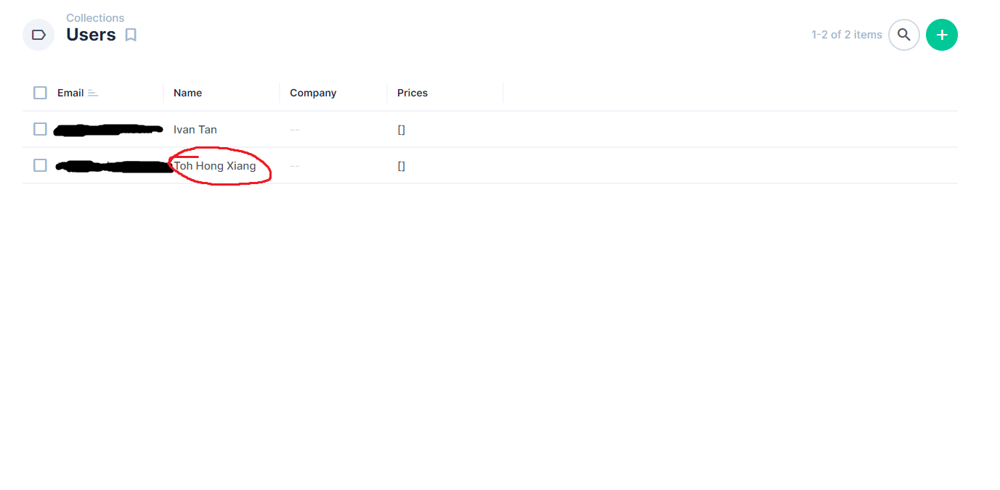
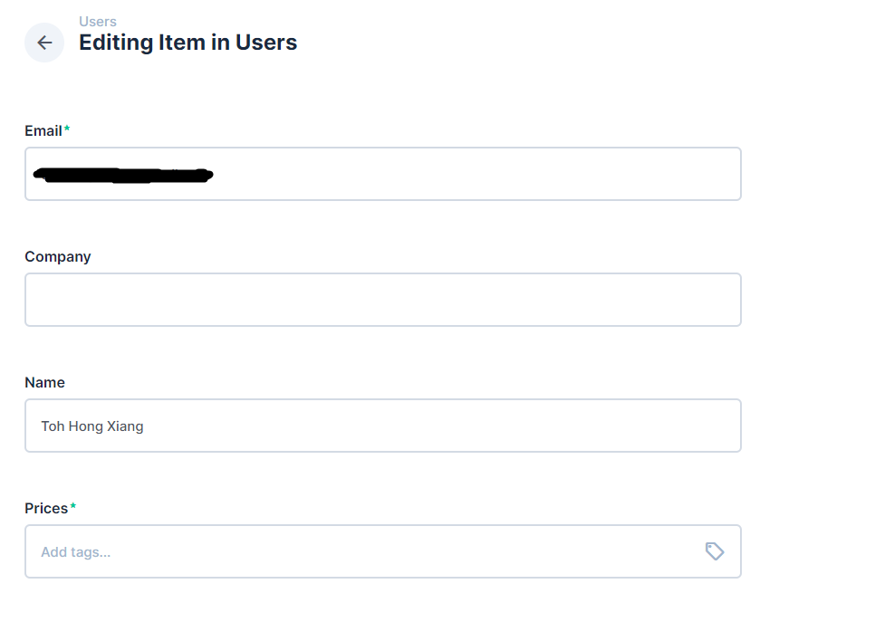
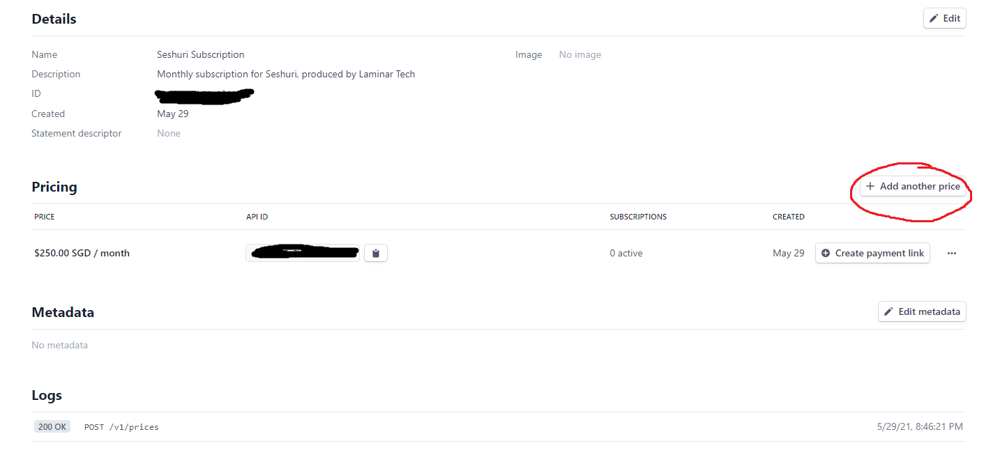
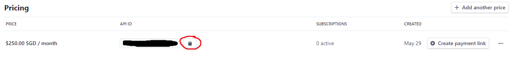
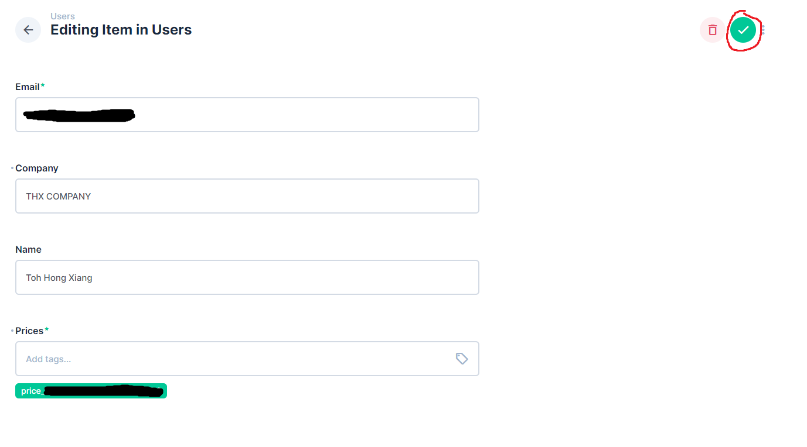

# Seshuri Payments

# Setup

## Get Google Client ID and Secret 

1. Follow instructions [here](https://www.balbooa.com/gridbox-documentation/how-to-get-google-client-id-and-client-secret) to generate clientID and clientSecret
   - Authorized redirect URI: http://localhost:3000/api/auth/callback/google
2. Copy `.env.example`, rename as `.env`, and fill in `GOOGLE_ID` and `GOOGLE_SECRET`

## Get Stripe Client ID and Secret

1. Go to [Stripe Dashboard](https://dashboard.stripe.com/dashboard) and get the publishable key and secret key. 
2. Fill in `NEXT_PUBLIC_STRIPE_PUBLISHABLE_KEY` and `STRIPE_SECRET` respectively.
3. In stripe dashboard, remember to fill in the following required links for the customer portal
   - Terms of Service
   - Privacy Policy
4. Get the productID of the product being sold, and fill in `PRODUCT_ID`

## Set up database for users

1. From local, create a database dump and copy to remote

```
pg_dump -U postgres database-name > database-dump 
scp directus-dump username@host:/home/username/directus-dump
```

2. Create db and dump

```
createdb database-name
psql database-name < database-dump 
```

3. Fill in the following for the `.env` file

```
DIRECTUS_EMAIL=
DIRECTUS_PASSWORD=
DIRECTUS_URL=
DB_DATABASE=
DB_USER=
DB_PASSWORD=
```

# Update Deployment

```
git pull
npm run build
pm2 restart --update-env <name-of-pm2-process>
```


# Onboarding Clients

1. Make client login
2. Login to CMS, click the "Users" collection, and you will see the client's entry



3. Click the entry to edit it. Fill up company empty fields.



   - The most important field is `prices`, which is an array of prices that are available to the client
   - If required, add a price
   - 
   - Copy the `price_id` from stripe, and paste into the field. Then press "Enter" to confirm
   - 
   - Once completed, save the entry
   - 


4. Save and ask client to refresh the page
5. Make client pay

# Collections inside CMS

## Users
- A list of users that have logged in to the application

## Announcements
- A list of announcements that will be displayed at the side on the login page

# Resources
- [NextAuth.js](https://next-auth.js.org/)
- [Getting started with Next.js, TypeScript, and Stripe](https://www.youtube.com/watch?v=sPUSu19tZHg)
- [Stripe Customer Portal](https://stripe.com/docs/billing/subscriptions/customer-portal)

